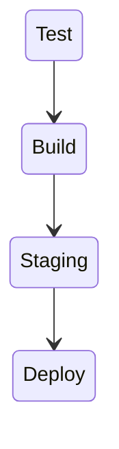
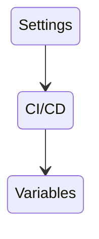

# CI Pipelines

The [.gitlab-ci.yml](/.gitlab-ci.yml) configures the behavior of the GitLab CI/CD pipeline for this component.

The CI/CD configuration must be adapted for the latest UCS version of the branch.

This files implements four stages, of which only the first two are available in user/feature branches.  

The `Staging` and `Deploy` stage are only available on the default branch.

## Test

This stage implements quick sanity checks on the committed code changes. It is
there to detect quality issues with the changes and provide a quick feedback
to the developer. These stage should not take longer than a few seconds to
execute.

## Build

This stage uses the `dpkg-buildpackage` tool to create packages and
stores these as artifacts. These can be downloaded and installed on a UCS
system.

## Staging

The changes from the repository are copied over to the main server. This step
is usually referred to as `import` at Univention.

## Deploy

In this stage the package is built again, but this time it is deployed into
our testing repository. The testing repository can be used in UCS systems
from within the Univention network (e.g. VPN) by adding it to the
`/etc/apt/sources.list`, like so:

    deb [trusted=yes] http://192.168.0.10/build2/ ucs_4.4-0-errata4.4-7/all/
    deb [trusted=yes] http://192.168.0.10/build2/ ucs_4.4-0-errata4.4-7/$(ARCH)/

Packages can be manually tested from there and can also be released. 

The `release` stage may be a subject for a future development and is not there yet.

## Specialities

* If the commit message contains `skip-build`, the CI pipeline never reaches
  the staging and deploy stages.

* The [.gitlab-ci.yml](/.gitlab-ci.yml) file has to be adapted for every major branch. Special
  care must be taken for the `variables` sections with all the version numbers.

* The `$SSH_PRIVATE_KEY` variable in [.gitlab-ci.yml](/.gitlab-ci.yml) is not defined in the
  `variables:` section, but rather a [project specific setting in gitlab
  ](https://docs.gitlab.com/ee/ci/variables/#cicd-variable-types). 

# SSH_PRIVATE_KEY

* Settings -> CI/CD -> Variables: Type: File, Protected (make sure the main branch is a protected branch)

# Workarounds

The `$SSH_PRIVATE_KEY` variable points to a file within the docker container
and this file is created by Gitlab. The contents of this file is configurable
under

and we are using `Type: File` for it. The problem is though, that while this
file gets truncated within the docker container by one byte, which cuts of
the last minus sign of the SSH key stored in there. This makes the SSH client
complain with the error message: `ssh unknown key format`.

A future-proof solution is to append a newline after SSH key, because that will
still work, even when the bug is fixed in Gitlab.

## Decision making

During the creation of this continuous integration process, a number of decisions have been made, as follows:

### Should `repo_admin` and `build-package-ng` run in individual stages?

The `repo_admin` and `build-package-ng`  are run in different stages.
The pros and cons of this decision are:

:heavy_check_mark: Pro:

- Resembles the manual workflow.
- Shortens the log for each command.
- Either of these steps could fail. It is easier to see which one.
- Do one thing and do it right.
- Allows manual restarts of individual steps.

:x: Contra:

- The pipeline gets longer
- We see no use in it for possible future developments, that jobs could run in
  parallel in the staging or deploy stage.

