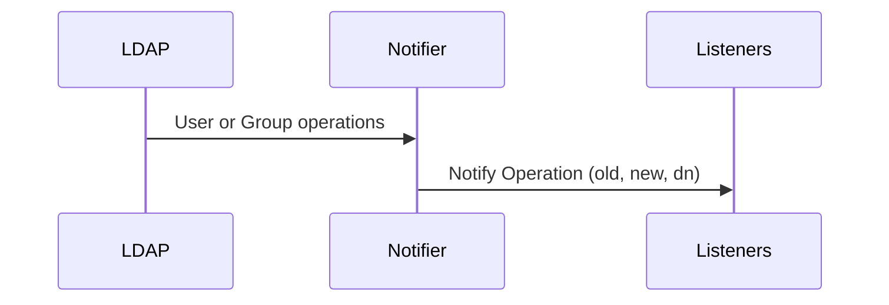
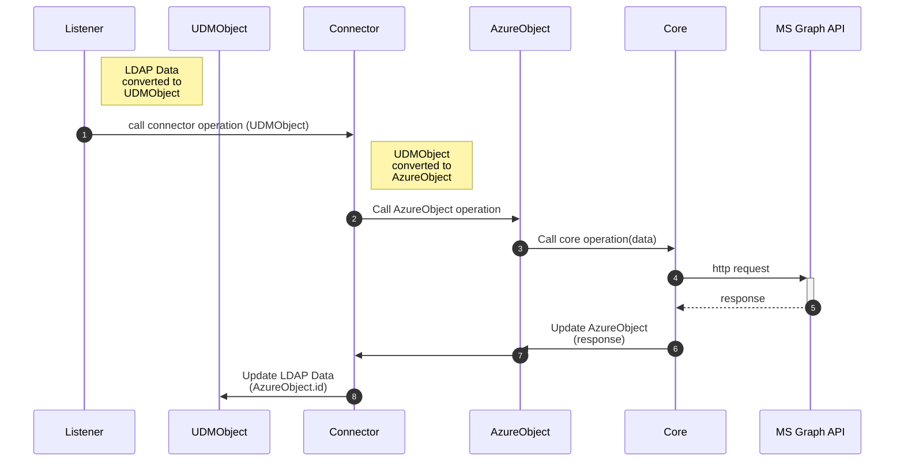
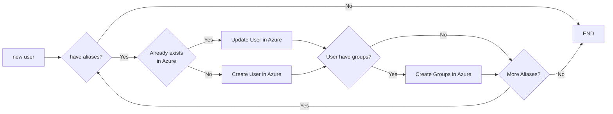
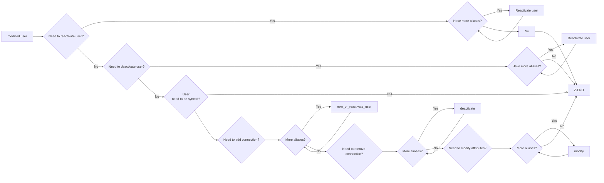
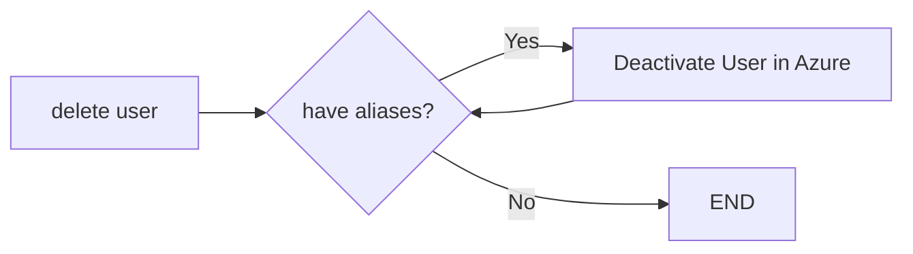

[[_TOC_]]

# Design Principles

The code for this connector is organized into a module called office365 inside the main univention python module.
All the code and classes have being designed trying to clearly separate the functionality of code related
with UCS and UDM and on the other hand the functionality related with the connection to the Microsoft Graph API.

```
                         univention.office365
                       ┌────────────────────────────────────────────────────────────────────────────────────────────────────────┐
                       │                                                                                                        │
                       │                                                                                                        │
                       │       UDMWrapper                Connector                    Microsoft                                 │
                       │      ┌─────────────────────┐   ┌────────────────────────┐   ┌──────────────────────────────────────┐   │
┌─────────────┐        │      │                     │   │                        │   │                                      │   │
│             │        │      │  ┌──────────────┐   │   │   User Connector       │   │                    ┌─────────────┐   │   │
│    User     │        │      │  │              │   │   │  ┌─────────────────┐   │   │    ┌─────────┐     │             │   │   │
│  Listener   │        │      │  │  UDM         │   │   │  │                 │   │   │    │         │     │             │   │   │
│             │        │      │  │  User        │   │   │  │                 │   │   │    │  Azure  │     │             │   │   │
└─────────────┘        │      │  │  Object      │   │   │  │                 │   │   │    │  User   │     │             │   │   │
                       │      │  │              │   │   │  ├──────────┐      │   │   │    │         │     │             │   │   │
                       │      │  └──────────────┘   │   │  │   User   │      │   │   │    └─────────┘     │             │   │   │
                       │      │                     │   │  │  Parser  │      │   │   │                    │             │   │   │
                       │      │                     │   │  └──────────┴──────┘   │   │                    │    Azure    │   │   │
                       │      │  ┌──────────────┐   │   │                        │   │                    │    Core     │   │   │
                       │      │  │              │   │   │                        │   │    ┌─────────┐     │             │   │   │
                       │      │  │  UDM         │   │   │                        │   │    │         │     │             │   │   │
┌─────────────┐        │      │  │  Group       │   │   │                        │   │    │  Azure  │     │             │   │   │
│             │        │      │  │  Object      │   │   │   Group Connector      │   │    │  Group  │     │             │   │   │
│    Group    │        │      │  │              │   │   │  ┌─────────────────┐   │   │    │         │     │             │   │   │
│  Listener   │        │      │  └──────────────┘   │   │  │                 │   │   │    └─────────┘     │             │   │   │
│             │        │      │                     │   │  │                 │   │   │                    └─────────────┘   │   │
└─────────────┘        │      └─────────────────────┘   │  │                 │   │   │                                      │   │
                       │                                │  ├──────────┐      │   │   │                                      │   │
                       │                                │  │  Group   │      │   │   │                                      │   │
                       │                                │  │  Parser  │      │   │   │                                      │   │
                       │                                │  └──────────┴──────┘   │   │                                      │   │
                       │                                │                        │   │                                      │   │
                       │                                └────────────────────────┘   └──────────────────────────────────────┘   │
                       │                                                                                                        │
                       └────────────────────────────────────────────────────────────────────────────────────────────────────────┘
```

In the middle, a connector classes are being used to connect to the Microsoft Graph API and to the UCS LDAP side.
Only these classes have the needed "knowledge" to connect both sides.

You should be able to use most of the code outside the listeners.
When modifying code, please keep the separation of where which objects are used.

## Listeners

To understand how the `listeners/notifier` mechanism works you should read the Listeners section of the [UCS developer Manual](https://docs.software-univention.de/developer-reference-5.0.html#chap:listener).

This connector is using the [High-level Listener modules API](https://docs.software-univention.de/developer-reference-5.0.html#listener:handler:42).

When a notification about changes in the LDAP directory is triggered, two listeners take actions for this component:

* [office365-user](/listeners/office365-user.py) for the users
* [office365-group](/listeners/office365-group.py) for the groups

These listeners are in charge of creating the corresponding [Connector](#connector), the [UDMObjects](#udm-wrapper)
from the `old` and `new` data received from the Notifier for the triggering operation (Create, Modify or Delete), and calling the connector method replicate it in Azure.

---

## Modules

The main module for this connector is `univention.office365`.
Several submodules are defined following the design shown above.

To better understand the usage of each submodule, please read the following sections.

### UDM Wrapper

```
                ┌──────────────┐
                │              │
                │   UDMObject  │
                │              │
                └──────┬───────┘
                       │
                       │
                       │
              ┌────────▼──────────┐
              │                   │
              │  UDMOfficeObject  │
              │                   │
              └────────┬──────────┘
                       │
         ┌─────────────┴───────────────┐
         │                             │
┌────────▼────────┐            ┌───────▼──────────┐
│                 │            │                  │
│  UDMOfficeUser  │            │  UDMOfficeGroup  │
│                 │            │                  │
└─────────────────┘            └──────────────────┘
```

When the listener receives an event from the UCS LDAP side for an action, it also receives
the `dn` of the object, the data of the object before the operation (`old`), the data of the object
after the operation (`new`) and the action (converted in a method call in the high level API).
This data of the `old` and the `new` LDAP object arrives as a dictionary of string keys and bytes values.
This dicts are then processed by the UDM wrapper to get the representation of the object in a UDM class.
The underlying LDAP reference is also kept as an attribute of the new UDM class.

These classes are a higher level abstraction of the objects in the LDAP layer.

The functionality of underlying UDM Objects have being extended to take care of the information related with the Microsoft connections/information
of each object.

#### SubscriptionProfile

#### UniventionOffice365Data

Each LDAP object that is being synced in Azure has a `univentionOffice365Data` attribute.
This information is used for internal bookkeeping and not easily accessible
via LDAP search, because it is stored encoded as `base64(zipped(json(dict)))`

The `UniventionOffice365Data` is intended to represent this information and to easily encode/decode it as needed.

#### UDMOfficeObject, UDMOfficeUser, UDMOfficeGroup

`UDMOfficeObject` is the base class for all the other two and implements all the common functionalities.

It's specially interesting explain how the UDMOfficeObject relates with the AD Connections.
Each UDMOfficeObject can be configured to be synced in several connections.

For a given time, a `UDMOfficeObject` should only have at most one active connection, this is represented internally by the `current_connection_alias` attribute.
In order to be able to perform operations on all the connections on which an object is replicated,
the `aliases` generator has been implemented, which assigns to current_connection_alias each of the connections for which
this object is configured and sets it back to `None` when finished.

`UDMOfficeUser` and `UDMOfficeGroup` implement the specific functionality for the users and groups, to retrieve information
, save and update the information related with the AD Connections.

You can take a look into the code to get more information about the [implementation](/modules/univention/office365/udmwrapper/udmobjects.py) of these classes.

#### Usage examples

Creating `UDMOfficeUser` instances from the old and new data received in the listener:

```python
# self._ldap_credentials is available in the listener class
# old, new and dn are supplied as arguments in the method call of the listener

# For users
new_udm_user = UDMOfficeUser(ldap_fields=new, ldap_cred=self._ldap_credentials, dn=dn, logger=logger)
old_udm_user = UDMOfficeUser(ldap_fields=old, ldap_cred=self._ldap_credentials, dn=old_dn or dn, logger=logger)

# For groups
new_udm_group = UDMOfficeGroup(ldap_fields=new, ldap_cred=self._ldap_credentials, dn=dn, logger=logger)
old_udm_group = UDMOfficeGroup(ldap_fields=old, ldap_cred=self._ldap_credentials, dn=old_dn or dn, logger=logger)

```

It's also possible to create `UDMOfficeObject` instance directly from the `dn` of the object,
not passing any field and getting the data from LDAP.

```python
# For users
user = UDMOfficeUser(ldap_fields={}, ldap_cred=self.ldap_cred, dn=dn_of_the_user)

# For groups
group = UDMOfficeGroup(ldap_fields={}, ldap_cred=self.ldap_cred, dn=dn_of_the_group)
```

Looping over the connections to which an UDM Office User is replicated:

```python
for alias in udm_user.aliases():
    # for this iteration of the loop, the udm_user.current_connection_alias is set to an specific connection
    # every action performed on the udm_user related with azure will be performed on this connection.
    pass
```

Setting the current connection alias to a temporal value you can use a context manager like this:

```python
with udm_office_group.set_current_alias(alias):
    # perform actions on the udm_office_group related with azure connected alias
    pass
```

----

### Microsoft

Currently, the [Microsoft Graph API](https://docs.microsoft.com/en-us/graph/overview) integrate all the Microsoft Cloud service resources.
It includes the sincronization of an on-premises AD with the [Azure AD](https://docs.microsoft.com/en-us/graph/api/resources/azure-ad-overview?view=graph-rest-1.0).
There are several SDKs to work with this API, but for historical reasons
(no Python version existed when the connector was implemented), we are keeping our own implementation through the REST API.

The API is a moving target, but has stable versions that can be used explicitly.
We're currently using [Version 1.0 of the REST API](https://docs.microsoft.com/en-us/graph/use-the-api).

While developing this wrapper around the Microsoft Graph API the thinking of keeping it as
independent as possible from the UCS LDAP side was taken into account. This way the `univention.office365.microsoft`
module could be used as an independent module to operate over the Microsoft Graph API.

```
                                        ┌─────┐
                                        │Token│
                                        └──┬──┘
                                           │
                                           │
                                           │
                                           │
                                           │
                                     ┌─────┴────┐
                                     │     ▼    │               │
                                     │  Azure   │               │
                                     │  Account │               │
        ┌───────┐                    │          │               │
        │Azure  │                    └─────┬────┘               │
        │User  ◄├────────────┐             │                    │
        └───────┘            │             │                    │
                             │             │                    │
       ┌────────┐            │             │                    │                  .-~~~-.
       │ Azure ◄├────────────┤        ┌────┴────┐◄─────────────►│          .- ~ ~-(       )_ _
       │ Group  │            │        │    ▼    │               │         /        Microsoft    ~ -.
       └────────┘            ├────────┤  Azure  │    Requests   │        |         Graph             \
                             │        │  Core   │◄─────────────►│         \        API              .'
     ┌──────────┐            │        │         │               │           ~- . _____________ . -~
     │  Azure   │            │        └─────────┘◄─────────────►│
     │  Team   ◄├────────────┤                                  │
     └──────────┘            │                                  │
                             │                                  │
┌───────────────┐            │                                  │
│               │            │                                  │
│ Azure         │            │                                  │
│ Subscription ◄├────────────┘                                  │
│               │                                               │
└───────────────┘                                               │
                                                                │
                                                                │
                                                                │
```

#### Manifest

We make the administrator download and re-upload the manifest while progressing through the MS365 setup wizard.
While everything that is in the manifest could be configured directly in the Azure portal, modifying the manifest 
in our code to our needs is way less error-prone than showing the administrator even more screenshots of things 
he should do manually in the Azure portal. With this in mind:

1. The manifest is downloaded by the user from their [Azure Application](https://docs.microsoft.com/en-us/graph/auth-register-app-v2).
2. The manifest contains, among other things, permissions for the application.
3. The function `def transform` in [manifest.py](/modules/univention/office365/microsoft/manifest.py) appends needed permissions to the manifest, which is then re-uploaded by the user.
4. The added Microsoft Graph permissions are:
    
      ```python
      # Permission Name: Directory.ReadWrite.All, Type: Application
      {"id": "19dbc75e-c2e2-444c-a770-ec69d8559fc7", "type": "Role"},
      # Permission Name: Group.ReadWrite.All, Type: Application
      {"id": "62a82d76-70ea-41e2-9197-370581804d09", "type": "Role"},
      # Permission Name: User.ReadWrite.All, Type: Application
      {"id": "741f803b-c850-494e-b5df-cde7c675a1ca", "type": "Role"},
      # Permission Name: TeamMember.ReadWrite.All, Type: Application
      {"id": "0121dc95-1b9f-4aed-8bac-58c5ac466691", "type": "Role"}
      ```
5. The manifest is re-uploaded by the user to the Azure Application.
6. The permissions will be displayed in the *API permissions* Tab in the Azure Portal.


#### Token

A [token](https://docs.microsoft.com/en-us/graph/auth-v2-user#3-get-a-token) is used to authenticate the user/application with the Microsoft Graph API.
This token is stored in a class and instantiated for each Azure Account.
Every time we want to [make a request](https://docs.microsoft.com/en-us/graph/auth-v2-user#4-use-the-access-token-to-call-microsoft-graph) to the Microsoft Graph API, we need to provide the token.
The tokens  are short-lived, and we must [refresh](https://docs.microsoft.com/en-us/graph/auth-v2-user#5-use-the-refresh-token-to-get-a-new-access-token) them after they expire to continue accessing resource.

#### Accounts

An AzureAccount object represents an account in the Azure Active Directory.
It stores the alias that identifies account, the current token and the related files.

The path for the files of an account is defined by [`<OFFICE365_API_PATH>/<alias>`](/modules/univention/office365/microsoft/__init__.py).

For an already configured account the following files are stored:

* `key.pem`:  File containing the private key of the account.
* `cert.pem`:  File containing the public certificate of the account.
* `cert.fp`:  File containing the fingerprint of the public certificate.
* `ids.json`: File containing information about the account (`domain`, `client_id`, `tenant_id` and `reply_url`).
* `token.json`:  File containing the last token of the account.
* `manifest.json`:  File containing the manifest of the account.

This object is also responsible for checking the validity of the token before using it and for refreshing it if expired.

#### Core | URLs

Core is the main class of our own implementation of the Microsoft Graph API python wrapper.
The urls and endpoints are defined in the [URLs](/modules/univention/office365/microsoft/urls.py) module.
This way if we want to change the base url, or the version of the API, we only need to change it the urls.py module.

The [core](/modules/univention/office365/microsoft/core.py) implements all the needed calls to the Microsoft Graph API,
wrapping the endpoints and taking care of the authentication, the token refreshing and the error handling.

You can find the corresponding documentation in the [Microsoft Graph API endpoints](https://github.com/microsoftgraph/microsoft-graph-docs/tree/main/api-reference/v1.0/api) here.
* API reference for [users](https://docs.microsoft.com/en-us/graph/api/resources/users?view=graph-rest-1.0).
* API reference for [groups](https://docs.microsoft.com/en-us/graph/api/resources/groups-overview?view=graph-rest-1.0).
* API reference for [teams](https://docs.microsoft.com/en-us/graph/api/resources/teams-api-overview?view=graph-rest-1.0).

Most of the functions of the `Core` are internally documented with the url to the Microsoft Graph API endpoint documentation.

#### Azure Objects

To keep an Object-Oriented approach some resources of the Microsoft Graph API are being organized into
classes representing the objects in the Microsoft Azure Directory service.

This classes contains the attributes and methods needed to interact with the Microsoft Graph API on a
higher level of abstraction. This avoids direct calls to the core, grouping some functionalities with the data that these calls require.

The classes are implemented as [Dataclasses](https://docs.python.org/3/library/dataclasses.html) but with the [attr.s](https://www.attrs.org) library help to make it compatible with 2.7.

Without going into too much detail (you can look into [the code](/modules/univention/office365/microsoft/objects/azureobjects.py)) the detailed description of each method, here are some details to keep in mind.
* `AzureObject` require an instance of a `Core` that in turn needs an `Account` since you need to be authorized in Azure to perform operations on the resources.  `set_core` method is used for this.
* Due to Azure Active Directory security policies, users or groups in the Azure AD
can't be deleted during synchronization.
  * They are merely disabled and renamed.
  * The licenses are revoked in the Azure Active Directory so that they become
  available to other users.
  * Users and groups whose names start with
  `ZZZ_deleted` can be deleted in Microsoft 365 Admin Center.

#### Classes

* **AzureObject**: Parent class that gathers the attributes and methods shared by most of the other objects.
* **UserAzure**: Object representation of a [User in Azure](https://docs.microsoft.com/en-us/graph/api/resources/user?view=graph-rest-1.0).
* **GroupAzure**: Object representation of a [Group in Azure](https://docs.microsoft.com/en-us/graph/api/resources/group?view=graph-rest-1.0).
* **TeamAzure**: Object representation of a [Team in Azure](https://docs.microsoft.com/en-us/graph/api/resources/team?view=graph-rest-1.0).
  - Some of these operations are performed asynchronously by Azure so these calls are implemented also [asynchronously](#async-queue-tasks) to not hang the Listeners.
* **SubscriptionAzure**: Object representation of a [Subscriptions in Azure](https://docs.microsoft.com/en-us/graph/api/resources/subscription?view=graph-rest-1.0).

#### Teams

For the new teams API we will require new permissions from the Wizard to be
set: `Group.ReadWrite.All`. This is done manually for now.

##### Comparison between Groups and Teams

Microsoft Teams is conceptionally very similar to Microsoft Groups and can be
described as a [different kind of group](https://support.microsoft.com/en-us/topic/learn-about-microsoft-365-groups-b565caa1-5c40-40ef-9915-60fdb2d97fa2).

* Groups remain to recommend way to connect with others in a classic (as in
  Exchange) fashion: By having a shared calendar and communication via Email.

* Teams share a common Chat-environment and team work is done within embedded applications.
  (This Video)[https://www.microsoft.com/en-us/videoplayer/embed/RWeqWA?pid=ocpVideo0-innerdiv-oneplayer&postJsllMsg=true]
  helps to showcase how the teams interface looks like and descibes its main functionities superficially.

The [Microsoft documentation](https://docs.microsoft.com/en-us/microsoftteams/office-365-groups#how-microsoft-365-groups-work-with-teams)
says about that:

> When you create a team, a Microsoft 365 group is created to manage team membership.

That said it is obvious, that a Group and a Team can coexist independently from
each other even if they have some functionality in common.


Differences between groups and teams:

|                 | group       | team          |
| -               | -           | -             |
| Membership type | Assigned    | Assigned      |
| Source          | Cloud       | Cloud         |
| Type            | Security    | Microsoft 365 |
| Object Id       | ?           | ?             |
| Creation date   | ?           | ?             |
| Email           | [undefined] | mandatory     |
| Owner           | optional    | mandatory     |


##### The team owner

Only users with a certain subscribtion can become team owners. They can be
identified by having the `"service": "TeamspaceAPI"` assigned to them
under `assignedPlans`. A user object could look similar to:

```
                {
                        "signInNames": [],
                        "mailNickname": "ad_test",
                        "postalCode": null,
                        "surname": "ad_test",
                        "userState": null,
                        "passwordProfile": null,
                        "assignedLicenses": [],
                        "lastDirSyncTime": null,
                        "userPrincipalName": "ad_test@office365.dev-univention.de",
                        "passwordPolicies": null,
                        "consentProvidedForMinor": null,
                        "userType": "Member",
                        "usageLocation": "DE",
                        "objectType": "User",
                        "city": null,
                        "assignedPlans": [
                                {
                                        "capabilityStatus": "Deleted",
                                        "assignedTimestamp": "2020-12-15T11:59:33Z",
                                        "servicePlanId": "76846ad7-7776-4c40-a281-a386362dd1b9",
                                        "service": "ProcessSimple"
                                },
                                [...]
                                {
                                        "capabilityStatus": "Deleted",
                                        "assignedTimestamp": "2020-12-15T11:59:33Z",
                                        "servicePlanId": "57ff2da0-773e-42df-b2af-ffb7a2317929",
                                        "service": "TeamspaceAPI"
                                },
                                {
                                        "capabilityStatus": "Deleted",
                                        "assignedTimestamp": "2020-12-15T11:59:33Z",
                                        "servicePlanId": "bea4c11e-220a-4e6d-8eb8-8ea15d019f90",
                                        "service": "RMSOnline"
                                },
                                {
                                        "capabilityStatus": "Deleted",
                                        "assignedTimestamp": "2020-12-15T11:59:33Z",
                                        "servicePlanId": "5136a095-5cf0-4aff-bec3-e84448b38ea5",
                                        "service": "exchange"
                                },
                                {
                                        "capabilityStatus": "Deleted",
                                        "assignedTimestamp": "2020-12-15T11:59:33Z",
                                        "servicePlanId": "5dbe027f-2339-4123-9542-606e4d348a72",
                                        "service": "SharePoint"
                                },
                        ],
                        "objectId": "12f89ccf-34b1-4a69-987a-8a5cd30cb2dd",
                        "showInAddressList": null,
                        "facsimileTelephoneNumber": null,
                        "creationType": null,
                        "state": null,
                        "streetAddress": null,
                        "userStateChangedOn": null,
                        "legalAgeGroupClassification": null,
                        "department": null,
                        "mail": "ad_test@office365.dev-univention.de",
                        "preferredLanguage": null,
                        "accountEnabled": true,
                        "userIdentities": [],
                        "refreshTokensValidFromDateTime": "2020-02-07T03:45:02Z",
                        "companyName": null,
                        "jobTitle": null,
                        "isCompromised": null,
                        "immutableId": "ODg0OTRkODItZGQ3NC0xMDM5LTkxZjctMzUwODA2MjMxMmRl",
                        [...]
```

Note that a user without these permissions does not have any content under
assignedPlans, whereas a user who had the permission at some point in time has
the permission `Deleted` as in this example. Only users with an `Enabled`
permission can become team owners.

Our tests have been able to create users with all necessary permissions in the
past. We have plenty of users prefixed with `zzz_deleted` in our directory,
because we were not able to delete them. Most of these deleted users have had
the correct permissions.

##### Example requests to illustrate differences between groups and teams

Here comes a successful return value after a team was created:

```json
{
        "x-ms-ags-diagnostic": "{\"ServerInfo\":{\"DataCenter\":\"West Europe\",\"Slice\":\"SliceC\",\"Ring\":\"5\",\"ScaleUnit\":\"002\",\"RoleInstance\":\"AGSFE_IN_81\"}}",
        "Content-Length": "0",
        "Content-Location": "/teams('d772b2ae-94ba-4f65-bd8a-c3b26a29a8d8')",
        "request-id": "68644b63-e6ad-4990-a2d1-67db06516bf0",
        "Strict-Transport-Security": "max-age=31536000",
        "client-request-id": "68644b63-e6ad-4990-a2d1-67db06516bf0",
        "Location": "/teams('d772b2ae-94ba-4f65-bd8a-c3b26a29a8d8')/operations('f60c891c-80b6-412e-822d-6dbef28350f3')",
        "Cache-Control": "private",
        "Date": "Mon, 01 Mar 2021 10:39:01 GMT",
        "Content-Type": "text/plain"
}
```
Note, that the `Location` contains the new teams id (in the string behind
'teams') together with the id of the new channel (behind 'operations')


In comparison: Here comes the return value, when a group is created:

```json
{
        "odata.type": "Microsoft.DirectoryServices.Group",
        "displayName": "testgroupazure",
        "description": "Azuretestgruppe",
        "objectId": "573ae468-5a74-4e74-a1d0-3cdaacd14519",
        "deletionTimestamp": null,
        "onPremisesSecurityIdentifier": null,
        "provisioningErrors": [],
        "odata.metadata": "https://graph.windows.net/3e7d9eb5-c3a1-4cfc-892e-a8ec29e45b77/$metadata#directoryObjects/@Element",
        "lastDirSyncTime": null,
        "onPremisesNetBiosName": null,
        "securityEnabled": true,
        "mailNickname": "testgroupazure",
        "proxyAddresses": [],
        "dirSyncEnabled": null,
        "onPremisesDomainName": null,
        "mail": null,
        "mailEnabled": false,
        "onPremisesSamAccountName": null,
        "objectType": "Group"
}
```

##### A Team from a Group

There is also an API call to create a team out of a group. Does that mean, that
we can store a single value to save either group and team on our side?

When we create a team out of the group `573ae468-5a74-4e74-a1d0-3cdaacd14519`,
we get:

```json
{
        "x-ms-ags-diagnostic": "{\"ServerInfo\":{\"DataCenter\":\"West Europe\",\"Slice\":\"SliceC\",\"Ring\":\"5\",\"ScaleUnit\":\"002\",\"RoleInstance\":\"AGSFE_IN_32\"}}",
        "Content-Length": "0",
        "request-id": "384579f5-2d3d-4e1c-9ea0-3ddc4dfda5eb",
        "Strict-Transport-Security": "max-age=31536000",
        "client-request-id": "384579f5-2d3d-4e1c-9ea0-3ddc4dfda5eb",
        "Location": "/teams('573ae468-5a74-4e74-a1d0-3cdaacd14519')/operations('44d88dd0-f410-4508-8f24-b02f3774913a')",
        "Cache-Control": "private",
        "Date": "Mon, 01 Mar 2021 11:19:41 GMT",
        "Content-Type": "text/plain"
}
```
Note how this team has the same id as the group. The object is located under
`/teams`. This makes the object unique to a team, so that a team can have
different properties to it, than a group.

Let us compare the different properties:

A group object (` ./terminaltest.py --get_group 573ae468-5a74-4e74-a1d0-3cdaacd14519 ''`)
```json
{
        "mailNickname": "testgroupazure",
        "securityIdentifier": "S-1-12-1-1463477352-1316248180-3661418657-424006060",
        "classification": null,
        "deletedDateTime": null,
        "renewedDateTime": "2021-03-01T10:42:43Z",
        "id": "573ae468-5a74-4e74-a1d0-3cdaacd14519",
        "onPremisesProvisioningErrors": [],
        "membershipRuleProcessingState": null,
        "preferredLanguage": null,
        "expirationDateTime": null,
        "@odata.context": "https://graph.microsoft.com/v1.0/$metadata#groups/$entity",
        "theme": null,
        "preferredDataLocation": null,
        "mail": null,
        "isAssignableToRole": null,
        "onPremisesSamAccountName": null,
        "onPremisesLastSyncDateTime": null,
        "description": "Azuretestgruppe",
        "securityEnabled": true,
        "proxyAddresses": [],
        "creationOptions": [],
        "visibility": null,
        "displayName": "testgroupazure",
        "groupTypes": [],
        "resourceProvisioningOptions": [
                "Team"
        ],
        "onPremisesSyncEnabled": null,
        "createdDateTime": "2021-03-01T10:42:43Z",
        "membershipRule": null,
        "onPremisesNetBiosName": null,
        "resourceBehaviorOptions": [],
        "onPremisesSecurityIdentifier": null,
        "onPremisesDomainName": null,
        "mailEnabled": false
}
```

A team object with the same id (`./terminaltest.py --get_team 573ae468-5a74-4e74-a1d0-3cdaacd14519`)
```json
{
        "classification": null,
        "memberSettings": {
                "allowAddRemoveApps": true,
                "allowDeleteChannels": true,
                "allowCreateUpdateChannels": true,
                "allowCreatePrivateChannels": true,
                "allowCreateUpdateRemoveTabs": true,
                "allowCreateUpdateRemoveConnectors": true
        },
        "displayName": "testgroupazure",
        "description": "Azuretestgruppe",
        "internalId": "19:21ebad242b104f4681822134f31f3d16@thread.tacv2",
        "createdDateTime": "2021-03-01T11:19:41.233Z",
        "webUrl": "https://teams.microsoft.com/l/team/19:21ebad242b104f4681822134f31f3d16%40thread.tacv2/conversations?groupId=573ae468-5a74-4e74-a1d0-3cdaacd14519&tenantId=3e7d9eb5-c3a1-4cfc-892e-a8ec29e45b77",
        "guestSettings": {
                "allowCreateUpdateChannels": false,
                "allowDeleteChannels": false
        },
        "@odata.context": "https://graph.microsoft.com/v1.0/$metadata#teams/$entity",
        "messagingSettings": {
                "allowTeamMentions": true,
                "allowOwnerDeleteMessages": true,
                "allowUserDeleteMessages": true,
                "allowChannelMentions": true,
                "allowUserEditMessages": true
        },
        "visibility": "public",
        "isArchived": false,
        "isMembershipLimitedToOwners": false,
        "funSettings": {
                "allowStickersAndMemes": true,
                "allowGiphy": true,
                "giphyContentRating": "moderate",
                "allowCustomMemes": true
        },
        "discoverySettings": {
                "showInTeamsSearchAndSuggestions": true
        },
        "id": "573ae468-5a74-4e74-a1d0-3cdaacd14519",
        "specialization": "none"
}
```

It becomes clear, that a team and a group are different object types, even
though they can share the same id.

#### Exceptions
The exceptions related with the Microsoft Graph API are defined in the [exceptions'](/modules/univention/office365/microsoft/exceptions) submodule.
* [Core Exceptions](/modules/univention/office365/microsoft/exceptions/core_exceptions.py): Microsoft Graph API [error codes](https://docs.microsoft.com/en-us/graph/errors) are mapped to Python Exceptions.
* [Login Exceptions](/modules/univention/office365/microsoft/exceptions/login_exceptions.py): Exceptions related to the login, authentication, connection and token refreshing.
* [Other Exceptions](/modules/univention/office365/microsoft/exceptions/exceptions.py). 

#### Usage examples

There are some common methods to Azure User, Group and Team objects.
Static methods (need a Core related to the account) are:
* `<azure_object>.get(<core>, <azure_object_id>)`: get the object from the Azure Account.
* `<azure_object>.list(<core>)`: list the objects of the type <azure_object> in the Account.
* `<azure_object>.get_fields()`: get the fields of the object.

For instances of the AzureObject class, the following methods are available:
* `<azure_object>.get_not_none_values_as_dict()`: get the values of the object as a dictionary.
* `<azure_object>.set_core()`: set the core of the object.
* `<azure_object>.create()`: create the object in the Azure Account.
* `<azure_object>.delete()`: delete the object from the Azure Account.
* `<azure_object>.update()`: update the object in the Azure Account.
* `<azure_object>.deactivate()`: deactivate the object in the Azure Account.
* `<azure_object>.reactivate()`: reactivate the object in the Azure Account.
* `<azure_object>.wait_for_operation()`: convenience wait for an operation on the core to finish.


The creation of new Azure objects is also common to all subclasses.
You can create new objects on several ways.
To create a new user, group or team you can use the following methods:
```python
user = UserAzure()
group = GroupAzure(id=<objectid>)
team = TeamAzure(displayName=<team_name>, description=<description>)
subscription = SubscriptionAzure(**subscription)
```

Any of the objects that inherit from AzureObject can be created empty or with the attributes set.
Attributes are passed as keyword arguments, or you can unpack a dictionary. 

Every different Azure class has different specific convenience methods.
Some examples are:
```python
# For users
user.create_or_modify(...)
user.get_assignedLicenses(...)
user.get_by_onPremisesImmutableID(...)
user.invalidate_all_tokens(...)
user.reset_password(...)

# For groups
group.add_member(...)
group.add_members(...)
group.add_owner(...)
group.create_or_modify(...)
group.exist(...)
group.get_by_name(...)
group.is_delete(...)
group.list_members(...)
group.list_members_id(...)
group.list_owners(...)
group.reactivate(...)
group.remove_direct_members(...)
group.remove_member(...)
group.remove_owner(...)

# For teams
team.add_member(...)
team.add_members(...)
team.create_from_group(...)
team.create_from_group_async(...)
team.delete_member(...)
team.list_team_members(...)
team.set_owner(...)
team.update(...)
team.wait_for_team(...)

# For subscriptions
subscription.get_enabled(...)
subscription.get_plans_id_from_names(...)
subscription.get_plans_names(...)
subscription.has_free_seats(...)
```

All the Azure objects code can be found in the [azureobjects](/modules/univention/office365/microsoft/objects/azureobjects.py) package.

---

### Connector

To this point classes and methods to work with the data from the UCS/LDAP side and the Microsoft Azure Directory on the other side.

No logic have being described to connect the two sides.

This is the main function of the connector submodule. When the listener receives an action related with an object in the UCS LDAP side,
it's converted to the corresponding UDM Office object and then a specific connector is used
to replicate the operation on the Microsoft Azure Directory side.

```
              ┌───────────────────┐       ┌─────────────────────┐
              │                   │       │                     │
              │    Connector      │       │ ConnectorAttributes │
              │                 ◄─┼───────┤                     │
              └────────┬──────────┘       └─────────────────────┘
                       │
         ┌─────────────┴───────────────┐
         │                             │
┌────────▼────────┐            ┌───────▼──────────┐
│                 │            │                  │
│  UserConnector  │            │  GroupConnector  │
│                 │            │                  │
└─────────────────┘            └──────────────────┘
```


#### ConnectorAttributes

To determine which attributes of UDM objects should be replicated to Azure and how this should be done 
(some need to be processed before being replicated) a number of variables are set in UCR that define this behavior.

The ConnectorAttributes contains the attributes that should be replicated to Azure, load the attributes from UCR and 
implement the logic to process the attributes before they are replicated.

* `mapping`: Maps the names of LDAP attributes to the names of the attributes in the Azure Active Directory.
* `sync`: LDAP attributes that should be synchronized with the Azure Active Directory
* `static`: LDAP attributes that should be synchronized with the Azure Active Directory but will contain a predefined value.
* `anonymize`: LDAP attributes that should be synchronized in anonymized form to the Azure Active Directory.
* `never`: LDAP attributes that should never be synchronized with the Azure Active Directory.
* `system`: Hardcoded attributes that should never be synchronized with the Azure Active Directory, never-mind if the admin set it or not in `never` or `sync`.
* `multiple`: Some Azure attributes can have composite values. This is a list of the LDAP attributes that can be used to create the composite value.

`mapping` is a dictionary that maps the LDAP attributes to the Azure attributes names. 
From these attributes, only the `sync` attributes are configured to be replicated to Azure. But the `static` attributes will have predefined values, not the ones in LDAP and the `anonymize` attributes will be obfuscated before being replicated to Azure.

The system admin can set some attribute names in `never` to prevent them from being replicated to Azure. 
It doesn't matter if they are in the `sync` or `static`, if they are also in the `never` attributes, they will be discarded.
Finally, the `multiple` attributes is created by checking if more than one LDAP attribute maps to the same azure property, and then it's stored in multiple

If an attribute is in `sync` but not in `mapping`, it will be ignored.
```
┌────────────────────────┐
│                        │
│                        │                                                            *F: Filtering out
│        mapping         │                                                            *P: Processing
│                        │
│                        │
└───────────┬────────────┘
            │
            │
            ▼
  ┌────────────────────┐
  │                   F│
  │                    │
  │        sync        │
  │                    │
  │                    │
  └─────────┬──────────┘
            │
            │
            │
            ├─────────────────┬─────────────────┐
            │                 │                 │
            │                 │                 │
            │          ┌──────▼──────┐          │         ┌─────────────┐      ┌─────────────┐
            │          │            P│          ▼         │            F│      │            F│      ┌─────┐
            │          │    static   ├───────────────────►│    never    ├─────►│   system    ├─────►│AZURE│
     ┌──────▼──────┐   │             │          ▲         │             │      │             │      └─────┘
     │            P│   └─────────────┘          │         └─────────────┘      └─────────────┘
     │  anonymize  │                            │
     │             ├────────────────────────────┘
     └─────────────┘
```


#### Connector
Parent class of UserConnector and GroupConnector. It defines the common methods and attributes.
* `check_permissions`: Checks if the right permissions are defined for the connections.
* `has_initialized_connections`: Checks if the connections have been initialized.
* `get_listener_filter`: Returns the filter to be used by the listener.
* `_load_filtered_accounts`: Return the string representation of the LDAP filter to be used in the listeners.
* `create`: _Abstract_.
* `delete`: _Abstract_.
* `modify`: _Abstract_.
* `parse`: _Abstract_.

`UserConnector` and `GroupConnector` have methods inherited from `Connector` to create, delete and modify this objects. Also, several convenience methods
have being implemented in each class to take care of some dependencies between these objects (memberships, ownership, etc).

#### UserConnector
Specific implementation of common methods for `UserConnector`:
* `create`: Creates the user in the Azure Active Directory for every configured connection.
* `delete`: It doesn't delete the user from Azure, it just deactivates for a permissions reason.
* `modify`: More complex logic applies here:
  * User may need to be reactivated in all the connections.
  * User may need to be deactivated in all the connections.
  * User may need to be reactivated in some connections and deactivated in others.
  * Attributes of the user may need to be updated.
* `parse`: Implements the logic to convert a UDM Office User to an Azure User.
* `prepare_azure_attributes`: returns the only attributes that will be saved into UDM Office user after replicating into Azure.

Methods only in `UserConnector`:
* `anonymize_attr`: return uuid.uuid4().hex ?¿
* `deactivate`: calls the Azure User deactivation method.
* `new_or_reactivate_user`: checks if the user is new or reactivated and calls the appropriate method.

#### GroupConnector
Considerations: By default, LDAP groups are not synchronized with Azure. This only occurs if the UCR flag [`office365/groups/sync`](#office365-groups-sync) is `True` 
and only those groups that contain users that synchronize with Azure will be synchronized.

This implies that the groups are not directly related to an Azure connection. The connection in which the group needs to be replicated is defined
the connections in the users members of the group are replicated.

Let us define the following connections to azure:
* `connection_1`
* `connection_2`

and users:
* `user_1`
* `user_2`

and groups:
* `group_A`
* `group_B`

then: 
* if (`user_1` in `group_A`) and (`user_1` in `connection_1`)
  * then `group_A` in `connection_1`
* if (`user_1` in `group_A`) and (`group_B` in `group_A`) and (`user_2` in `group_B`) and (`user_1` in `connection_1`) and (`user_2` in `connection_2`)
  * then (`group_A` in `connection_1`) and (`group_A` in `connection_2`) and (`group_B` in `connection_2`)  

[//]: # (TODO: look for a better way to explain this.)

Specific implementation of common methods for `GroupConnector`:
* `create`: Creates the group in the Azure Active Directory for every configured connection.
* `delete`: For each connection it does the next steps
  * If the group is a Team, deactivate team. 
  * Remove the direct members of the group.
  * Deactivate the group.
* `modify`: For each connection it does the next steps
  * Check if the group needs to be created
  * Check if the group needs to be reactivated
  * `check_and_modify_attributes`
  * `check_and_modify_members`
  * `check_and_modify_owners`
  * `check_and_modify_teams`
* `parse`: Implements the logic to convert a UDM Office Group to an Azure Group.
* `prepare_azure_attributes`: returns the only attributes that will be saved into UDM Office group after replicating into Azure.

Methods only in `GroupConnector`:
* `add_ldap_members_to_azure_group`: adds the members of the group to the Azure group.
* `add_member`: adds a member to the Azure group.
* `convert_group_to_team`: converts the group to a team.
* `delete_empty_group`: deletes the group if it is empty.


#### Parser (UDMObjects => AzureObjects)

As a design decision we avoided including specific logic of conversion in any other UDM or Azure classes. 
So, one of the main functions of the connector is to be able to translate an UDMObject to the corresponding AzureObject.

In this translation, we need to use the [mapping of the attributes](#office365-attributes-mapping--). To take care of all these, the `ConnectorAttributes`
class parse the needed values and apply the expected precedences.

Both `GroupConnector` and `UserConnector` contain their own implementation of this method, but only in the latter contains certain slightly more complex operations to filter and extract the necessary information from the UDM object.

The returned values is an already created AzureObject with the expected information in it.


#### Usage examples
The best way to understand the usage of the UserConnector and GroupConnector is to look into the code of the 
[group](/listeners/office365-group.py) and [user](/listeners/office365-user.py) listeners.

---

### Helpers

During the development of the application, the need for certain functionalities that were repeated throughout the code was detected.
These functionalities not directly linked to the previously defined objects have been grouped in files according to their scope.

#### Utils

Several functions have being implemented to help with the development of the connector.

#### UCR Helper

Univention Configuration Registry Helper. This class is used to get the configuration values from the UCR related to the office365 connector.
Convenience methods are being implemented to get and process the values from the UCR.
Any operation related to UCR for this connector should be implemented in this class.

#### UDM Helper

Univention Directory Manager Helper. This class is used to get the UDM objects related to the office365 connector.
Convenience methods are being implemented to get and process the objects from UDM.
Any operation related to UDM for this connector should be implemented in this class.

#### JsonStorage

This class can be used to store data in json format. This class is used mainly by AzureAccount.

Using this class is easy, you only need to instance it with the name of the file where you want to save the data.

This class have 3 methods:

* `read`: Read data from file and return it. If the load process fail it return a empty dict
* `write`: Update the data with new data.
* `purge`: Write an empty dict in the file.

*_Note_*: In write and purge operation the class set permissions for listener user.


### Examples

Create an empty file:

```python
json_storage = JsonStorage("my_empty.json")
json_storage.purge()
```


 Write and read data:
```python
json_storage = JsonStorage("my_data.json")
data = json_storage.read()
# data = {}
json_storage.write(id="new_id", name="name_value")
data = json_storage.read()
# data = {'id': 'new_id', 'name': 'name_value}
```

---

### Async Queue/Tasks

Some Microsoft API calls are asynchronous ([teams operations](https://docs.microsoft.com/en-us/graph/api/resources/teamsasyncoperation?view=graph-rest-1.0) ). This means that the
call is made, but the result response is not returned immediately and we need to wait and repeat the call until the result is available.

Other problem related with this is that some calls are dependent on the previous ones. 
For example, if we create a team and then add a member to it, the team needs to be created before the member is added.

#### Async queue

A queue is used to store the `tasks` to be performed. The queue is
shared with another process ([async daemon](#async-daemon)) that will consume the actions and would
execute them.

The queue can be implemented with several backends.
The default is a [JSON Backend](/modules/univention/office365/asyncqueue/queues/jsonfilesqueue.py) (_json file directory_) containing files for each task.
A [Redis backend](/modules/univention/office365/asyncqueue/queues/redisqueue.py) is also available as an example but not currently used.

The code related to the Async Queue is in `univention/office365/asyncqueue/`.

#### Tasks

The asynchronous queue is designed in such a way that it can execute Tasks.

All Tasks can be defined in a hierarchical way, so that for one to complete, subtasks can be defined that must be completed beforehand.

These tasks are defined in an [abstract class](/modules/univention/office365/asyncqueue/tasks/task.py) that can be reimplemented as needed.
Currently, the only specific task type implemented is the [AzureTask](/modules/univention/office365/asyncqueue/tasks/azuretask.py).

An AzureTask contains the _alias_ of a connection on which the task will be executed, the name of the _method name_ to be called to execute it and the _arguments_ of the method.

When executing an AzureTask, a core is constructed from the supplied alias and the method of the core whose name was supplied when creating the task is called along with the arguments to be used.

In the execution of the AzureTask we are making use of the `retrying` library to try to make the call several times with waits in between to give Azure time to process the request.

#### Async daemon

Some azure calls need a try-sleep-retry.

To not block the listener at this point we have an async daemon for these calls *univention-ms-office-async* (share/univention-ms-office-async).

Started via `univention-ms-office-async.service` this daemon checks new tasks are available in the queue and executes them.

```
{
 "ad_connection_alias": <name of the connection alias to be used>,
 "method_name": <name of the method to be called>,
 "method_args": <list or dict of arguments>,
 "sub_tasks": [<dict representing a subtask>, ...]
 }
```

If the file can be verified (e.g. function exists or ad_connection_alias is available) *function_name* with the kwarg *parameters* is executed on the connection *ad_connection_alias*. If the job can't be verified or is successful the job is removed.

The daemon process does the following:

* drop privileges to listener(nogroup)
* while loop
* find tasks in the queue
* verify job -> success: execute task, failed: remove task
* resolve task dependencies
* execute task -> success: remove file, failed: go to next job (move failed jobs after *retry-count* times to *failed*)
* wait and loop

#### Usage examples

```python
from univention.office365.asyncqueue.tasks.azuretask import MSGraphCoreTask
from univention.office365.asyncqueue.queues.jsonfilesqueue import JsonFilesQueue

# Creation of the queue
q = JsonFilesQueue("o365asyncqueue")

# Creation of subtasks
subtasks = [MSGraphCoreTask(alias, "list_group_members", dict(group_id=group_id))]

# Creation of main task with subtasks
main_task = MSGraphCoreTask(alias, "list_group_owners", dict(group_id=group_id), sub_tasks=sub_tasks)

# Enqueueing of the main task
q.enqueue(main_task)
```

#### Related files
* Logfile: `/var/log/univention/listener_modules/ms-office-async.log`
* Autostart: `univention-ms-office-async/autostart`
* Job dir: `/var/lib/univention-office365/async` (make sure owned by listener)
* Failed dir: `/var/lib/univention-office365/async/failed` (make sure owned by listener)

---

### Data and calls flow

#### Client credentials flow - *used by listener*
With the help of the UMC wizard an SSL certificate is uploaded to Azure. The secret key is used by us to sign our 
requests and to verify their tokens. No user interaction is required to fetch new tokens.

The downside of the client credentials flow is, that some operations on the AAD are excluded from application permissions.   
The most notable, an application [does not have the rights to reset user passwords or to delete entities](https://docs.microsoft.com/en-us/previous-versions/azure/ad/graph/howto/azure-ad-graph-api-permission-scopes#DirectoryRWDetail) (including users or groups).

Now that we can authenticate, we can synchronize the selected users and groups with the Azure directory and manage the users licenses.  

"Synchronization" will be one-way: only from UCS to Azure AD. It should include the users minimal contact data and the groups that the users are in.

It is possible to configure through [UCR variables](#ucr-variables-to-modify-connector-behaviour) which attributes are synchronized and which not. It can also be configured if attributes should be anonymized.

## Authorization Code Grant Flow - ***not** used by listener!*

With this data the OAuth dance can begin. See "Authorization Code Grant Flow" (see https://msdn.microsoft.com/en-us/library/azure/dn645542.aspx).

In short:

* redirect the user to authenticate at an Azure-login
* user authorizes the requested permissions for the UCS App
* user gets redirected from Azure to the configured callback-URI (https://DC.DOM/office365/mycallback)
* the callback extracts a token from the URL and uses it to get some other tokens
* those tokens can be used to access the Azure AD and to refresh themselves when they expire (3600s)
* when the refresh token has expired the dance begins from the start. Currently, it is unknown how long it lasts... at least 6h it seams... The Azure doc states: "Refresh tokens do not have specified lifetimes. Typically, the lifetimes of refresh tokens are relatively long. [..] The client application needs to expect and handle errors..." (see https://msdn.microsoft.com/en-us/library/azure/dn645536.aspx)

We dance with a partner: requests-oauthlib (https://github.com/requests/requests-oauthlib). It does well, except for the refresh handling. This should be fixed in their code. But handling it ourselves is not a problem. Requests-oauthlib uses the "requests" lib for handling the HTTP requests. The requests lib might one day end up in the Python standard library.

#### Main call flow
This is not part of the application implementation but for the sake of correct understanding, 
this is a representation of the call flow that occurs when an LDAP object is modified in UCS.


From the point of view of this application, its execution always starts when one of the two Listeners
receives a notification of a new operation and the call flow, although with logical variations, is always similar to this one:


#### User creation
The logic behind the replication of a new object in Azure is:


#### User modification
Modifying a user in LDAP initiates a series of checks and actions required to replicate the information in Azure.
When a user has been modified it can be 1 of 3 different situations:
* Need synchronized.
* Need to NOT be synchronized.
* Attribute modifications.

Attribute Modification in turn involves several possible actions:
* Activation of the user in any of the connections
* Deactivation in any of the connections
* Modification of attributes in any of the connections



#### User Deletion

---
# Debug & Configuration

## Logging to files

To manage the logging of the connector, the [logging2udebug](/modules/univention/office365/logging2udebug.py) module is used.
The main function defined in this module is `get_logger(<logger_name>)` which returns a logger object with a specific formatter, 
log file and log levels defined. The UCR variable [office365/debug/werror](#office365-debug-werror) controls the level of the logging being much more verbose when set to `True`.

The admin or developer can find information about the execution of the connector in these files:
* `/var/log/univenton/listener.log`: contains the logs of all the listeners.
* `/var/log/univenton/listener_modules/`
  * `ms_office_async`: contains the logs of the async daemon.
  * `office_user`: contains the logs of the office user listener.
  * `office_group`: contains the logs of the office group listener.
* `syslog`: Some problems while interacting with the system could be logged in the syslog.

## UCR variables to modify connector behaviour

### univention-ms-office-async/autostart

This variable configures the start mode of the Univention MS Office Async Daemons. If set to 'no' or 'disabled', the service cannot be started. If the variable is set to 'manually', the service isn't started during system boot, but can be enabled manually at a later point.

_Type:_ str

### office365/attributes/usageLocation

Required for Azure users that will be assigned licenses due to legal requirement to check for availability of services in countries.

The `country` attribute of a user is given precedence over this setting.
If neither is set, the value of the UCR variable `ssl/country` is used.
For legal reasons it is recommended to set this variable.

_Type:_ str two-letter country code (ISO standard 3166).

### office365/debug/werror

Flag to enable the writing of log messages of all levels as errors (`ERROR`) and with debug information to the logfile.
This is used for debugging only.

_Type:_  bool

_Default:_
no

### office365/groups/sync

Flag to determine if groups that contain users with a Microsoft 365 account be synchronized or not.

_Type:_ bool

_Default:_
no

### office365/subscriptions/service_plan_names

Service plans names.
Will be used to detect which subscriptions to use.

_Type:_ str comma separated list

_Default:_
'SHAREPOINTWAC, SHAREPOINTWAC_DEVELOPER, OFFICESUBSCRIPTION, OFFICEMOBILE_SUBSCRIPTION, SHAREPOINTWAC_EDU'

### office365/migrate/adconnectionalias

DEPRECATED. To be removed in future releases. Don't use.
This variable can be used to deactivate the automatic migration of user and group accounts during the update of the app to version 3.0. If an administrator chooses to postpone the migration, it needs to be done manually later by running the script /usr/share/univention-office365/scripts/migrate_to_adconnectionalias. By default, the variable is unset and the automatic migration is run during the update of the app. Setting the variable to 'no' or 'false' before the app update will skip the automatic migration.

_Type:_ str

### office365/defaultalias

If the value is set to the adconnection alias of an initialized AD connection and no adconnection alias is configured on a user or group account when Office365 is enabled, they are synchronized to the Azure AD defined by this variable.

_Type:_ str

### office365/adconnection/wizard

The value of this Univention Configuration Registry-Variable defines which connection is configured by the next run of the Microsoft 365 Configuration Wizard. The value should not be empty. To see the available connections, '/usr/share/univention-office365/scripts/manage_adconnections list' can be called. The default after installation is 'defaultADconnection'.

_Type:_ str

### office365/attributes/mapping/.*

Used to configure synchronization of user attributes to the Azure Active Directory (AAD).
Variables in the format `office365/attributes/mapping/ATTRIBUTE-IN-LDAP=ATTRIBUTE-IN-AZURE`

_Type:_ str

_Default:_

```
    office365/attributes/mapping/l=city  
    office365/attributes/mapping/displayName=displayName  
    office365/attributes/mapping/employeeType=jobTitle  
    office365/attributes/mapping/givenName=givenName  
    office365/attributes/mapping/mobile=mobilePhone  
    office365/attributes/mapping/mail=otherMails  
    office365/attributes/mapping/mailAlternativeAddress=otherMails  
    office365/attributes/mapping/mailPrimaryAddress=otherMails  
    office365/attributes/mapping/postalCode=postalCode  
    office365/attributes/mapping/roomNumber=officeLocation  
    office365/attributes/mapping/st=usageLocation  
    office365/attributes/mapping/street=streetAddress  
    office365/attributes/mapping/sn=surname  
    office365/attributes/mapping/telephoneNumber=businessPhones
```

### office365/attributes/sync

LDAP attributes that should be synchronized with the Azure Active DirectoryAAD.
The names of the attributes must be included in `office365/attributes/mapping/.*` as ATTRIBUTE-IN-LDAP.

_Type:_ str comma separated list

_Default:_
`office365/attributes/sync=displayName,employeeType,givenName,l,mailPrimaryAddress,mobile,mailAlternativeAddress,mail,postalCode,roomNumber,st,street,sn,telephoneNumber`

### office365/attributes/static/.*

Configure synchronization of user attributes to the Azure Active Directory (AAD).
Variables in the format office365/attributes/static/ATTRIBUTE-IN-LDAP=VALUE
VALUE will be written to the corresponding attribute in AAD when a user is enabled for Microsoft 365.
Will have priority over attributes in `office365/attributes/sync`.
The names of the attributes must be included in `office365/attributes/mapping/.*` as ATTRIBUTE-IN-LDAP.

_Type:_ str

### office365/attributes/anonymize

LDAP attributes that should be synchronized in anonymized form to the Azure Active Directory.
The names of the attributes must be included in `office365/attributes/mapping/.*` as ATTRIBUTE-IN-LDAP.
Will be given precedence over attributes in `office365/attributes/static` and `office365/attributes/sync`.

_Type:_ str comma separated list

### office365/attributes/never

LDAP attributes that should never be synchronized with the Azure Active Directory.
Will be given precedence over attributes in `office365/attributes/anonymize`, `office365/attributes/static` and `office365/attributes/sync`.

_Type:_ str comma separated list
<details close>
<summary><b>Related files</b></summary>

* [debian/univention-office365.univention-config-registry-variables](/debian/univention-office365.univention-config-registry-variables)
* [scripts/package/40univention-office365.inst](/scripts/package/40univention-office365.inst)

</details>

---

# Changes in stored data in LDAP Objects
In the current version of this application, only 3 LDAP extended attributes are defined to hold office365 related information in the objects:
* `UniventionOffice365Data`: office data for all the connections is stored encoded as a json in base64
    ```json 
    {
        <AD connection alias>:
        {
            "userPrincipalName": <userprincipalname>,
            "objectId": <azure_object_id>,
        }, ...
    }
    ```
  * The keys of the dictionary are the names of the AD connections.
  * The values are dictionaries with the following keys:
    * `userPrincipalName`: the `userPrincipalName` of the user in Azure.
    * `objectId`: the `id` of the user in Azure.
  * Once a new connection is created, it's entry is added and never removed from this dict.
    * If the user is removed from the connection, only the userPrincipalName is removed from the dict.
    * This way we can keep track of the users in the connection in case it's reactivated.
* `UniventionOffice365ADConnectionAlias`: 
  ```['adConnectionName', ... ]``` 
  * All the connections names are stored in attribute as a list of strings. These strings are the aliases of the connection.
  * If a connection is deleted, the alias is removed from the list, but kept as key in the `UniventionOffice365Data` dict.
* `UniventionOffice365ADConnections`: DEPRECATED. Not used anymore but still not removed in the last version.
  * `[("adConnectionName", "UserPrincipalName"),...]`,  is a list of connection aliases in which this object needs to be replicated and the current `userPrincipalName` of this user for that connection.

# Changes in Azure Active Directory
During the lifetime of this application, the API for connecting to _Azure Active Directory_ has undergone several changes. The biggest one has been the discontinuation of _Azure AD Graph_, which has been taken over by _Microsoft Graph_.

This migration, which has been carried out in several phases, is currently using version v1.0 of the _Microsoft Graph API_ 
and has been done following Microsoft's recommendations which can be found in the 
[App migration planning checklist](https://docs.microsoft.com/en-us/graph/migrate-azure-ad-graph-planning-checklist), 
with special interest in [Property differences between Azure AD Graph and Microsoft Graph](https://docs.microsoft.com/en-us/graph/migrate-azure-ad-graph-property-differences).

The Microsoft Graph API is the successor of the former Azure Graph API.
Microsoft kept its new API mostly compatible with its predecessor, but not
entirely. The most obvious difference is the url against which all API calls
have to be performed. It changed from `graph.windows.net` to
`graph.microsoft.com` and each individual call now needs an API version number
as part of the new URL, e.g.

    https://graph.microsoft.com/v1.0/teams/[team_id]/members

Before using the API an access token must be acquired. There are different ways
to get one of these, and they expire automatically after some time. Actually
Microsoft provides with
[msal](https://github.com/AzureAD/microsoft-authentication-library-for-python)
a python library for the log-in process, but we decided against using it.

Our implementation is kept simple in that it can only acquire an access token
by using an application certificate. The token itself is a long string which
appears to be not human-readable at first, but turns out to be base64 encoded.
Decoding it on the terminal comes handy for debug sessions:

    echo 'eyJ0...[]' | base64 -d

The log-in works slightly different for Graph than it did for Azure:

* the directory_id became optional

* the url contains a version number and makes the tenant_id superfluous (because
  it is also contained in the certificate)

* the scope parameter [has to be adjusted](https://docs.microsoft.com/en-us/
  graph/migrate-azure-ad-graph-authentication-library#migrating-to-msal).

* the return value contains a relative time for `expires_in` rather than an
  absolute time `expires_at`.

* a token for Azure cannot be used with Graph.

The actual API access is mostly consistent: There is always the request url
(see above) and then either an empty payload or JSON in the request and the
answer has either an empty body or JSON, but always a http status code, which
is well-defined in the Microsoft documentation and only a very few calls have
more than one success value. All calls however return errors one and the same
[list](https://docs.microsoft.com/en-us/graph/errors), which makes a generic
call to catch these very appealing.

A further aspect of development with the Graph API is, that [pagination works
slightly different](https://docs.microsoft.com/en-us/graph/paging).

# Dependencies / Constraints

## Teams

In order to create Teams, at least one group owner must be set.
To convert a group into a team, the group must be of type MS365, not security group. The doc says so, but the API allows creating of a team from a security group
To create a team, all group owners must have a license that includes Teams.

Prior to communication with the Azure API, authentication and authorization is done through OAuth2.

After installing the App, a wizard (similar to UCS@school and UCC) will run that will request the UCS user to make some configuration on its behalf. Mainly that is registering and configuring an application in Azure AD. Some of this can be supported pragmatically, some can't...

The wizard must retrieve the following data from the user:

* the client ID
* the Federation Data Document Url
* the Azure Application manifest

The manifest is downloaded by the user from their Azure application. The manifest contains, among other things, permissions for the application.
The function *def transform* in azure_auth.py appends needed permissions to the manifest, which is then re-uploaded by the user.
This includes permissions for the Azure Active Directory Graph API (resourceAppId: 00000002-0000-0000-c000-000000000000)
and the Microsoft Graph API (resourceAppId: 00000003-0000-0000-c000-000000000000). The permissions will be displayed in the *API permissions* Tab in the Azure Portal.


IDEA FOR A DATA FLOW DIAGRAM:

UCS
LDAP
change

Listener
receives representation
of the old and new object
and the operation executed

Creates corresponding UDM objects

Call corresponding Connector Method

--

For each ad connection configured for the UDM object

Resolve the operation logic
(object dependencies, recursion, ...)

Creates the corresponding Azure Object (parse)

Call the method of the Azure Object

--

Prepare data

Call the Graph API with the credentials of the ad connection
through the Core wrapper implementation.

[//]: #
[//]: #
[//]: #
